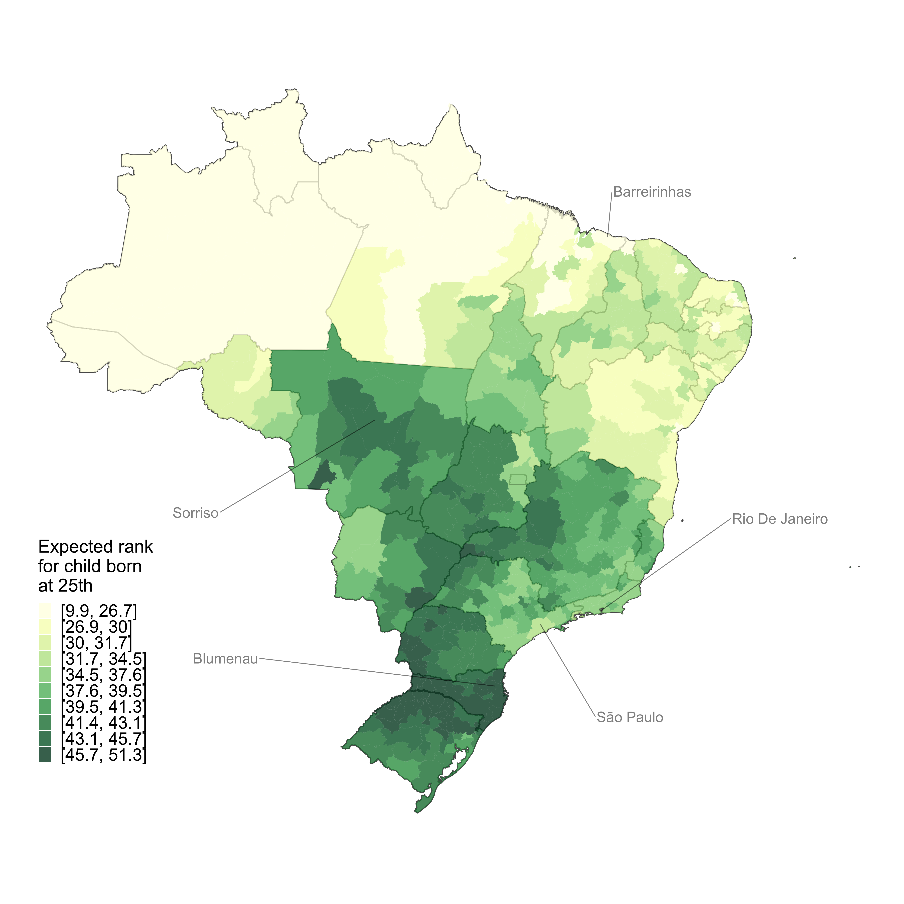

---

##### Download

+ [Paper](IGM_BFPSW.pdf)

---

##### In the Media

+ [VoxEU](https://cepr.org/voxeu/columns/intergenerational-mobility-land-inequality-case-brazil)
+ [Folha de São Paulo](https://www1.folha.uol.com.br/mercado/2022/10/filhos-de-familias-pobres-tem-so-25-de-chance-de-chegar-ao-topo-no-brasil.shtml)
+ [Valor Econômico](https://valor.globo.com/brasil/noticia/2022/10/16/no-brasil-local-de-nascimento-afeta-chance-de-subir-na-vida.ghtml)

---

##### Abstract

We provide the first estimates of intergenerational income mobility using population-wide tax data for a large developing country, namely Brazil. We measure formal income from tax and payroll data, and we train machine learning models on census and survey data to predict informal income. We develop methods to quantify and characterize the estimation bias resulting from income imputation and other sources of measurement error, and show that such bias remains negligible in our context. A 10 percentile increase in parental income rank is associated on average with a 5.5 percentile increase in child income rank, and only 2.5% of children born to parents in the bottom quintile reach the top quintile. Mobility varies widely by gender, race, and geographical areas, and causal place effects explain 57% of variation in mobility across regions.

---

##### Figure: Average adult income rank of children born in the 25th percentile of the parental income distribution

---

##### Citation

Britto et al. 2022. "Intergenerational Mobility in the Land of Inequality." *Working Paper* 

---

